# Отчет по работе 1

### Задание 1
* Исполняемый файл (исполняемый код) - файл, содержащий
программу в виде набора элементарных инструкций, которая после
загрузки в память может быть выполнена на определенном
физическом устройстве (процессоре) под управлением определенной
операционной системы
* Ассемблер - язык программирования низкого уровня, в котором
каждая инструкция физического устройства представлена в текстовом
виде
* Язык высокого уровня - язык, который абстрагируется от элементарных команд
процессора, позволяя записывать программы в виде более
абстрактных понятий, таких как: функции, алгоритмы, классы,
структуры данных и т.д
* Исходный код - Программа написанная на языке высокого уровня называется
исходным кодом
* Виртуальная машина - это средство описания семантики языка
программирования.
* Стандарт языка программирования - документ, описывающий
язык программирования максимально подробно и, по возможности,
наиболее формально.
* Транслятор - техническое средство, осуществляющее перевод
текста программы с одного языка на другой
* Компилятор - Транслятор, переводящий программу в машинный код
для последующего исполнения (С++)
* Интерпретатор -Транслятор, читающий и исполняющий программу по
одной команде (Lisp)
* Псевдокомпилятор - транслятор, переводящий программу в
промежуточное представление (байт-код), который состоит из набора
инструкций близких по смыслу к машинному коду.
* Компилирующий интрепретатор - транслятор, переводящий
текст программы во внутреннем представление непосредственно после
запуска. В процессе работы программа интерпретируется уже в этом
представление (Python).
* REPL-интерпретатор - Программное средство, работающее в
цикле чтения-вычисления-печати (Read-Eval-Print Loop).
Интерпретатор в режиме диалога считывает законченную конструкцию
языка, транслирует ее, исполняет и выводит результат (IDLE shell
Python).    
* Единица трансляции - минимальный фрагмент программы,
который может быть транслирован независимо от остального кода
* Синтаксические ошибки -  обнаруживаются на этапе проверки
синтаксиса во время трансляции.
* Ошибки с поздним обнаружением - относят ошибки
возникающие при выполнении программы
* Ошибки сборки - возникают при отсутствии одного из компонентов
программы
* Ошибки времени выполнения (run time error) - ошибки использования
виртуальной машины языка программирования, обнаруживаемые в
момент их возникновения, например, деление на ноль или выход за
границы массива.
* Непредсказуемое поведение - в результате неверного использования
виртуальной машины языка программирования дальнейшее исполнение
программы может приводить к непредсказуемым ошибкам. То есть
ошибки проявляются позже в непредсказуемый момент в
непредсказуемом виде.
* Неопределенное поведение - поведение программы однозначно, но не
определено описанием языка. Программы с неопредленным поведением
могут давать различные результаты при использовании различных
трансляторов.
* Препроцессинг (предобработка) - начальный этап трансляции
программы.
В ходе препроцессинга выполняются макроподстановки в исходный
текст программы.
Результатом препроцессинга является текст программы, который
далее проходит синтаксический анализ
* Сборка - заключительный этап трансляции, результатом которого
является исполняемый файл
* Объектный файл - Результат трансляции модуля,
который является переходным от текста программы к исполняемому
файлу. Объектный файл содержит имена идентификаторов из текста
программы, но команды уже переведены на язык исполнителя
* make - утилита для управления процессом компиляции и сборки
программ
### Задание 2
* shift+ f4 - создать файл
* f4 - редактировать файл
* f2 - сохранить файл
* shift + стрелка влево/вправо выделить в режиме редактирования  
* Insert - выделить файл
* f5 - скопировать файл 
* f6 - переименовать файл
* f7 -  создать папку
* f8 - удалить файл
* tab - смена окна far

### Задание 3
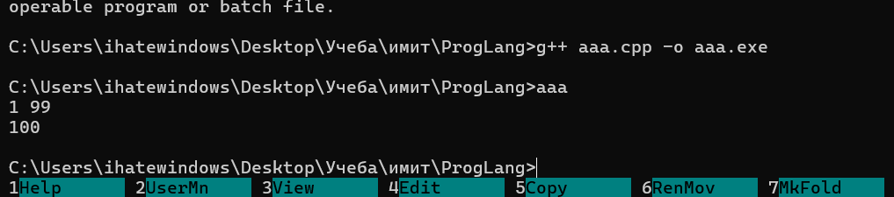

### Задание 4
Создание объектных файлов по отдельности
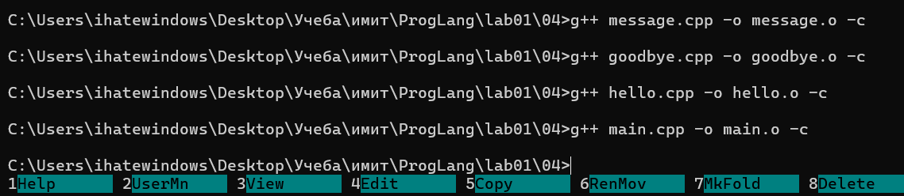
Сборка в исполняемый файл и его запуск
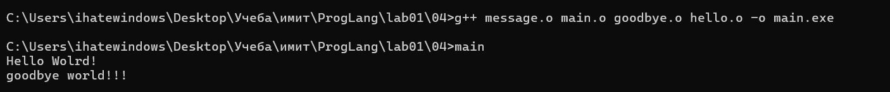
Если в файле синтаксическая ошибка, то мы не сможем собрать его в объектный  файл. Поэтому мы сможем выполнить компиляцию, но если изначально в файле ошибка, то мы также не сможем создать .o и соответственно не сможем собрать, ведь у нас не будет хватать файла для сборки
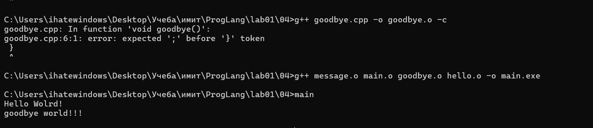
Если один из файлов будет потерян, то мы получим ошибку сборки
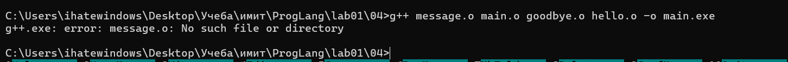

### Задание 5
Трансляция в байткод и запуск программы
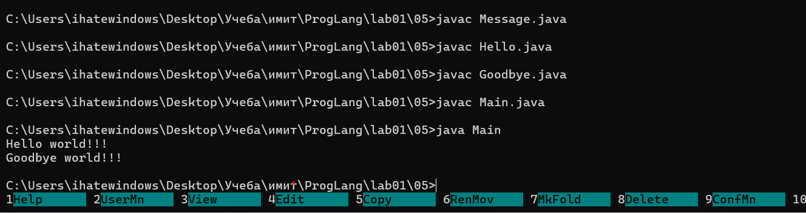
В джава нельзя скомпилировать один файл, если другой содержит ошибку
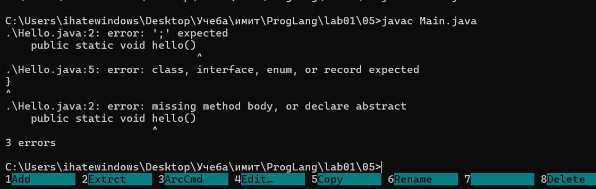
Появляется ошибка, что джава не может найти функцию 
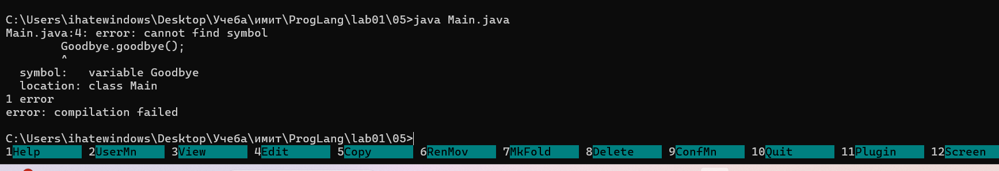

### Задание 6
Трансляция в байткод и запуск программы
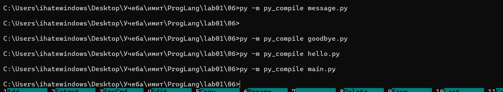
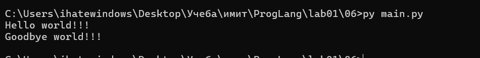
Как и в c++ в пайтоне можно выполнить компиляцию одного файла, если другой содержит синтаксическую ошибку
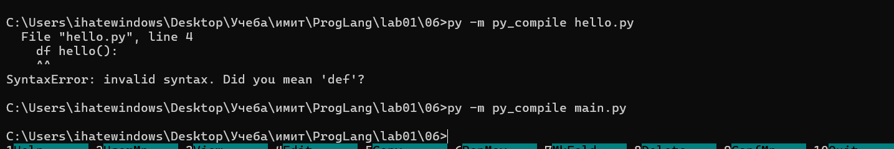
Получаем ошибку
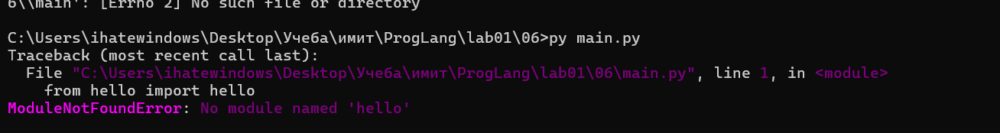
### Задание 7
Сборка и запуск прошли успешно
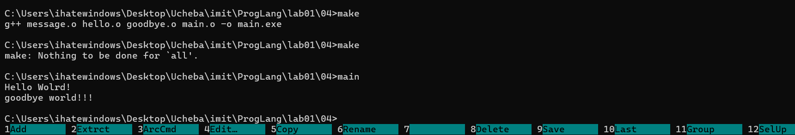
Трансляция в объектные файлы происходит только для измененных файлов, весь проект не собирается заново
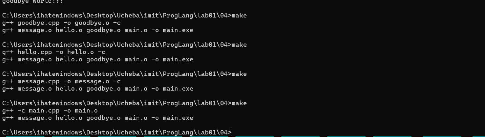
Если нет объектного файла make создает его заново
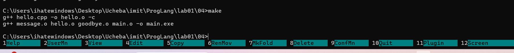
Если изменить прототип и сигнатуру самой функции, то все успешно собирается и запускается
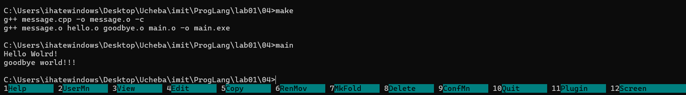
Если изменить только .h файл, то получаем ошибки и исполняемый файл не появляется 
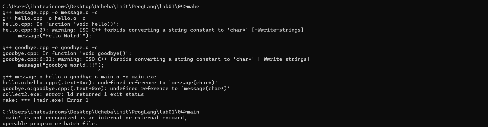
### Задание 8
Вывод вектора по индексу работает во всех всерсиях языка
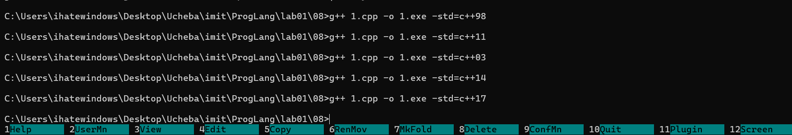
Цикл for-each с указанием типа выводимой переменой. Появился в стандарте 11-го года
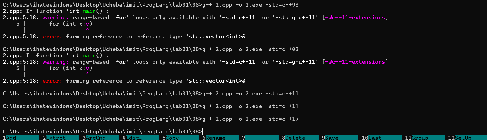
Цикл с auto, позволяет не указывть тип x. Также появился с 11-го стандрта
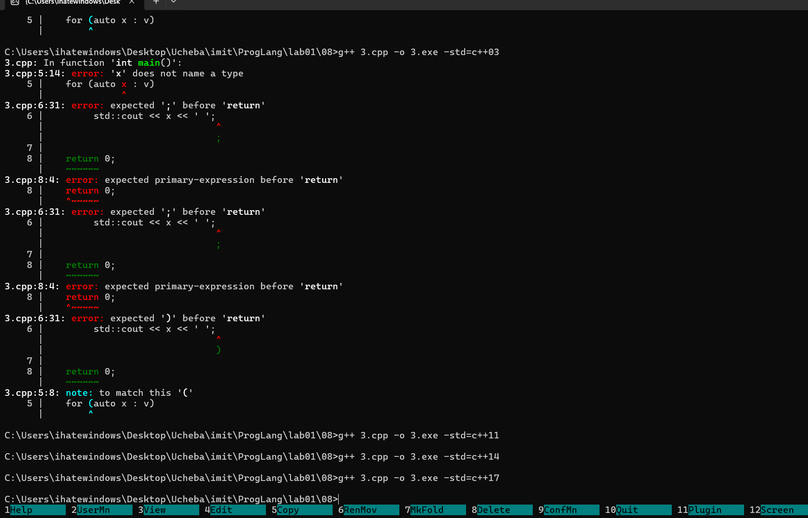
Инициализация списком позволяет указать значения элементов вектора. Работает со стандарта 11
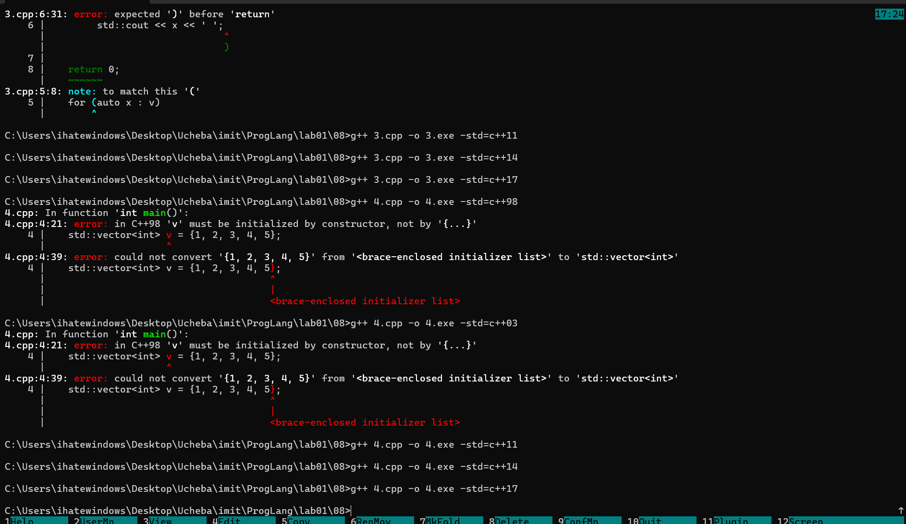
Возможность указать разделители числа для удобного чтения появмлась в стандарте 14
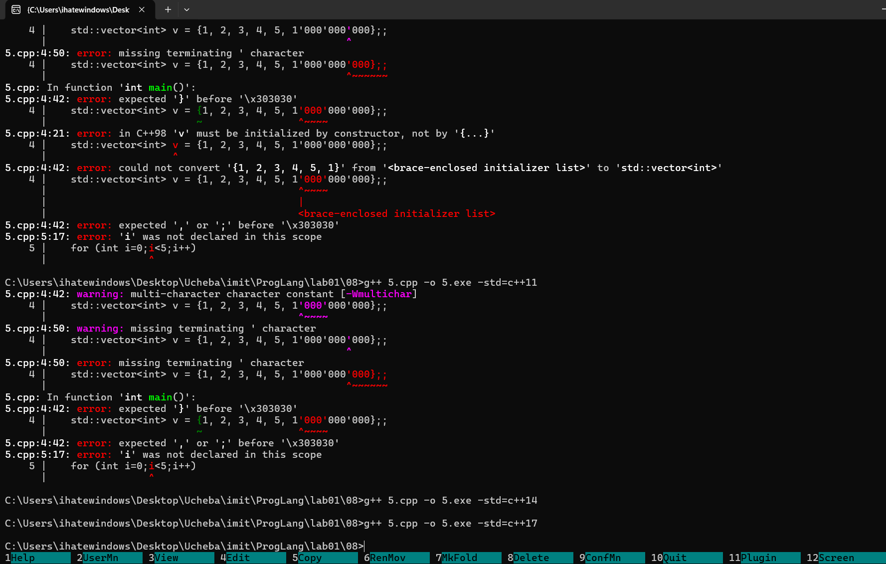
Возможность не указывать тип значений вектора введена со стандарта 17
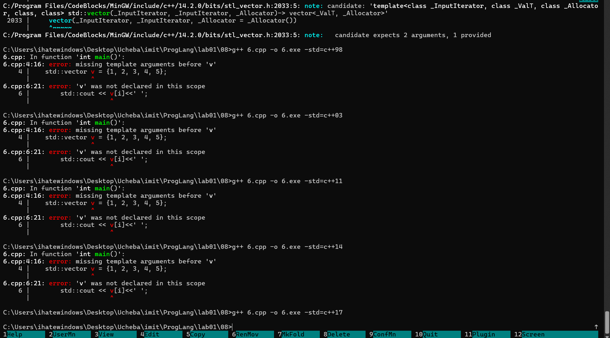
### Задание 9
* Оптимизация 0 - код переводится в асембллер напрямую, повторяя цикл и суммирование
* Оптимизация 1 - Пустой цикл и умножение 
* Оптимизация 2 - цикла нет, только умножение.
### Доп. задание 1
Строки 21-35
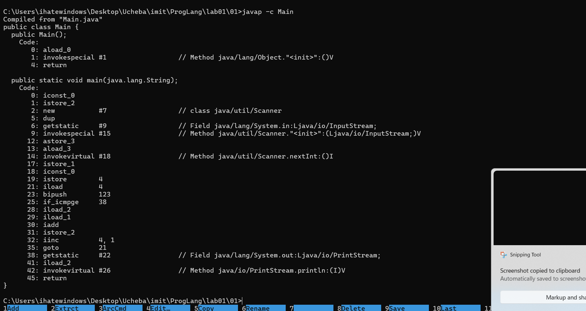
### Доп. задание 3
Дважды подключаем goodbye.h. Ошибка
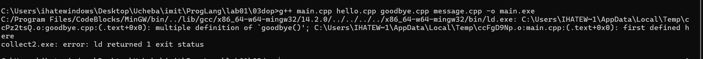
Добавили защиту
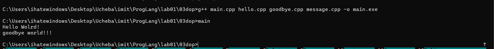

### Источники
* https://docs.oracle.com/javase/specs/jvms/se21/html/jvms-3.html - цикл в байт-коде
* https://docs.python.org/3/library/py_compile.html - как перевести в байт-код один пайтон файл
